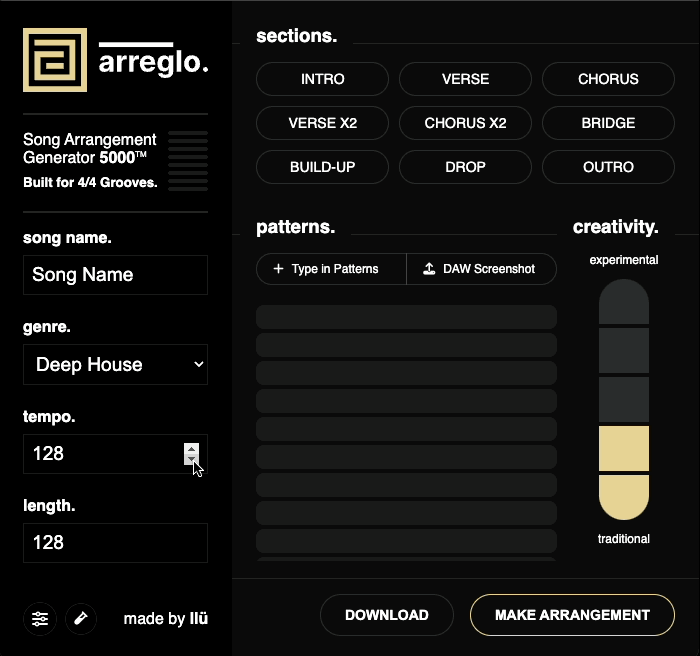

# Arreglo - AI-Powered Music Arrangement Generator

A Figma plugin that transforms simple pattern ideas into complete, professional-quality song arrangements using advanced AI. Specializes in house, techno, and trance music with authentic genre knowledge and intelligent pattern relationships.

Arreglo is evolving into a VST and web app experience that helps you write and arrange music, with an AI co-pilot to navigate and operate your DAW and installed plugins to produce, mix, and master with AI-assisted knowledge.

## 🎵 Try it Now
**[Download from Figma Community Store](https://www.figma.com/community/plugin/1473434918581718662/arreglo)**



## ✨ Highlights

### 🎯 **Professional AI Intelligence**
- **Multi-Stage Prompt Architecture**: 3-stage AI process for context analysis → energy arc design → detailed arrangement
- **Genre-Specialist AI**: Acts as expert house, techno, and trance arranger with authentic knowledge
- **50+ Pattern Types**: Comprehensive dance music vocabulary with frequency and energy mapping
- **Pattern Relationship Intelligence**: AI understands which patterns complement or conflict

### 🚀 **Latest AI Models** 
- **GPT-4o**: 50% faster with better musical reasoning
- **Claude-3.5-Sonnet**: 2x better at complex arrangement logic
- **Enhanced Quality**: Professional energy arcs and musically intelligent pattern placement

---

## 🎛️ Features

### **Intelligent Pattern Recognition**
- **Frequency-Aware**: Patterns mapped to sub, bass, mid, high frequency ranges for mixing guidance
- **Energy Classification**: 10-point energy system (foundation/driving/supporting/atmospheric/accent)
- **Genre Affinities**: Pattern compatibility for house, techno, trance with confidence scoring
- **Rhythmic Complexity**: From simple to polyrhythmic analysis

### **Professional Arrangement Generation**
- **Genre-Authentic Structures**: 
  - **House**: Controlled energy, strategic builds, four-on-the-floor fundamentals
  - **Techno**: Maximum intensity, hypnotic progression, industrial minimalism  
  - **Trance**: Epic builds, emotional breakdowns, uplifting tension/release
- **Smart Pattern Layering**: Foundation → melody → harmony → texture introduction order
- **Energy Arc Design**: Professional tension/release cycles based on dance music conventions

### **Advanced AI Capabilities**
- **Automatic Genre Detection**: Analyzes pattern sets with confidence percentages
- **Missing Pattern Suggestions**: Recommends genre-appropriate additions
- **Frequency Conflict Avoidance**: Prevents muddy mixes with intelligent frequency distribution
- **Creative Control**: 5-level creativity system from traditional to experimental

---

## 🛠️ How to Use

### **1. Install & Setup**
```bash
# Download from Figma Community Store
# Open Figma → Plugins → Arreglo
# Add your OpenAI API key in settings
```

### **2. Create an Arrangement**
```
Song Title: "Midnight Drive"
Genre: House
Length: 128 bars
Tempo: 124 bpm

Patterns:
- kick-4x
- bassline-rolling
- piano-chords-stab
- vocal-hook-filtered
- hi-hat-shaker
- breakdown-riser
```

### **3. AI Analysis & Generation**
The AI automatically:
1. **Analyzes** your patterns (frequency ranges, energy levels, genre fit)
2. **Detects** dominant genre characteristics with confidence scoring
3. **Designs** professional energy arc (intro → build → drop → breakdown → outro)
4. **Generates** musically intelligent arrangement with proper pattern relationships

### **4. Professional Visualization**
- **Timeline Grid**: Bar-by-bar pattern visualization
- **Color-Coded Instruments**: Consistent visual organization
- **Energy Flow Visible**: See tension/release cycles in the layout
- **Mixing-Friendly**: Frequency-aware pattern placement

---

## 🎨 Example Output


**What You See:**
- **Left Column**: Pattern names with their analyzed roles
- **Timeline Grid**: When each pattern plays (1 = active, dimmed = inactive)
- **Professional Structure**: Intro → Verse → Chorus → Bridge → Build → Drop → Outro
- **Intelligent Layering**: Foundation patterns (kick, bass) vs texture (vocals, effects)

---

## 🚀 Advanced Features

### **Pattern Intelligence**
```typescript
// AI understands semantic meaning:
"kick-4x"           → Foundation, Sub/Low-Mid, Energy: 9/10
"bassline-rolling"  → Foundation, Bass, Energy: 7/10  
"piano-stab"        → Harmony, Mid, Energy: 6/10
"vocal-hook"        → Texture, Mid/High, Energy: 5/10
"riser-breakdown"   → Accent, Full-Range, Energy: 8/10
```

### **Genre Detection**
```
Pattern Analysis Results:
- House: 85% confidence (4-on-floor + piano + vocal elements)
- Techno: 25% confidence (driving elements present)
- Trance: 15% confidence (some uplifting elements)

Recommendation: Optimize for House arrangement style
```

### **Energy Arc Design**
```
Professional House Energy Flow:
Intro:    20→40% (8 bars)  - Foundation building
Verse:    40→60% (16 bars) - Pattern introduction  
Chorus:   80→80% (16 bars) - Full energy
Breakdown: 30→30% (8 bars) - Tension break
Build:    40→90% (8 bars)  - Tension rise
Drop:     95→95% (16 bars) - Maximum energy
Outro:    60→20% (8 bars)  - Resolution
```

---

## 📋 Requirements

- **Platform**: Figma Desktop App or Web (Chrome/Firefox/Safari)
- **API Key**: OpenAI API key for AI features
- **Internet**: Required for AI processing

---

 

## 🎵 Pattern Vocabulary Examples

### **Rhythm Patterns**
```
kick-4x, kick-syncopated, snare-backbeat, hi-hat-16th, 
percussion-latin, claps-2-4, rim-shots, kick-sidechain
```

### **Bass Patterns**  
```
bassline-rolling, bass-stab, sub-drone, bass-arp, 
bassline-walking, bass-reese, bass-303, bassline-pumping
```

### **Harmonic Elements**
```
piano-chords, synth-pad, organ-stab, guitar-rhythm,
strings-sustain, brass-stab, chord-progression, arpeggios
```

### **Vocal & Effects**
```
vocal-hook, vocal-chop, vocal-pad, riser-sweep, 
impact-hit, reverse-cymbal, filter-sweep, glitch-fx
```

---

## 📖 Documentation

- **[Backend Refactor Plan](docs/backend-refactor-plan.md)**
- **[Payment System Integration](docs/payment-system-integration.md)**

---

 

## 📄 License

**MIT License** - Free for personal and commercial music production use.
