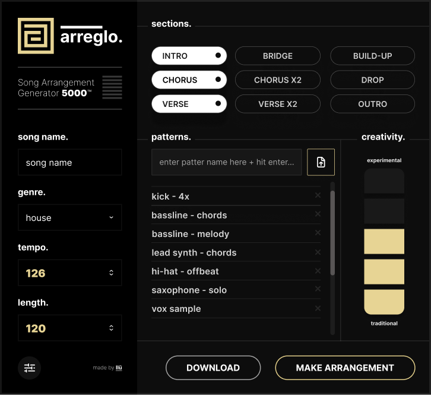
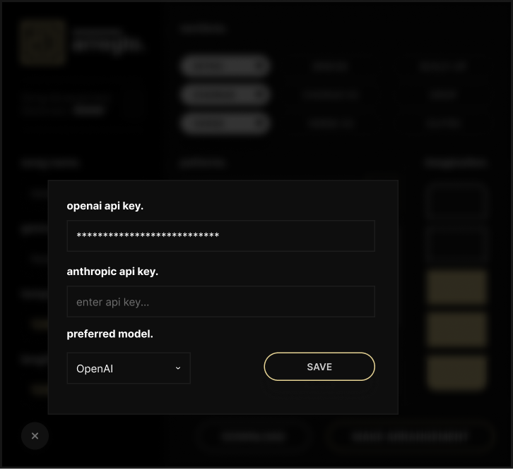
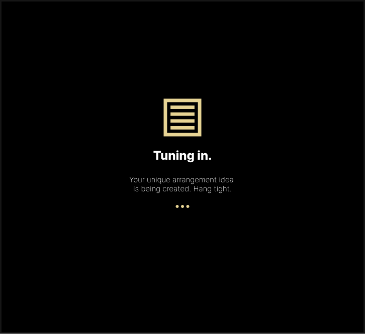
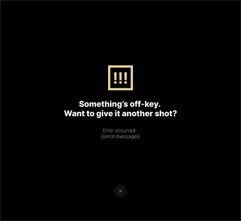
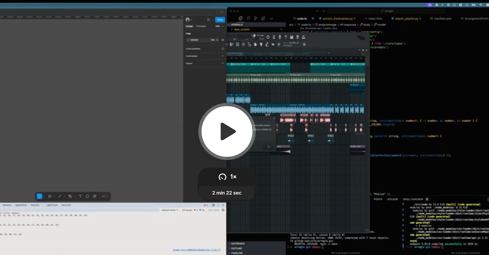
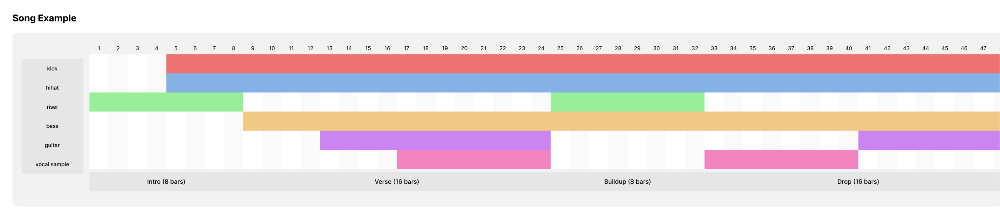

## Arreglo - Figma Plugin

Arreglo is a Figma plugin that helps music producers visualize song arrangements. Using AI, it generates and visualizes song structures based on your input, making it easy to plan and understand song arrangements.

### Interface

The plugin features a clean, modern interface designed for music producers:

#### Main Interface

Create arrangements by setting song details, adding patterns, and selecting sections.

#### Settings Panel

Configure your API keys and preferences.

#### Loading State

Visual feedback while your arrangement is being generated.

#### Success State

Confirmation when your arrangement is ready.

#### Error Handling

Clear error messages if something goes wrong.

### Demo Video

### Current Example Output

This example shows a generated arrangement with:
- Multiple sections (Intro, Verse, Chorus, Bridge, etc.)
- Custom instrument patterns
- Adjustable creativity levels
- Visual grid layout showing when each instrument plays

### Features

- **AI-Generated Arrangements**: Get complete song arrangements based on your inputs
- **Visual Grid Layout**: See exactly when each instrument plays throughout the song
- **Section-Based Structure**: Choose from various song sections (Intro, Verse, Chorus, Bridge, Build-up, Drop, Outro)
- **Instrument Pattern Management**:
  - Manually add custom patterns
  - Upload DAW screenshots to automatically extract track names using AI
  - View and edit patterns in real-time
- **Customization Options**:
  - Adjustable song length (16-256 bars)
  - Tempo control (60-200 BPM)
  - Creativity slider to control arrangement style (Traditional to Experimental)
  - Multiple genre options (House, Techno, Trance, DnB, Pop, Rock, Jazz, etc.)

### Usage

1. Install and Run:
   * Open Figma
   * Run the "Arreglo" plugin

3. Configure (First Time Setup):
   * Open settings (gear icon)
   * Add your OpenAI API key
   * Save settings

4. Create an Arrangement:
   * Enter a song title
   * Choose a genre
   * Set desired length and tempo
   * Add instrument patterns:
     - Type manually and click "Add Pattern", or
     - Upload a DAW screenshot to extract track names
   * Select desired song sections
   * Adjust creativity level
   * Click "Create Arrangement"

5. View Your Arrangement:
   * See a grid showing when each instrument plays
   * Each row represents an instrument
   * Colored cells show active bars for each instrument
   * Section labels show the structure of your song

### Requirements

- Figma Desktop App or Figma Web (in supported browsers)
- OpenAI or Anthropic API key for AI features

### Future Plans
- Sexy looking UI
- Sexier looking arrangements
- Export arrangements to JSON and MIDI
- DAW Trackname Extractions
- Integration with DAWs