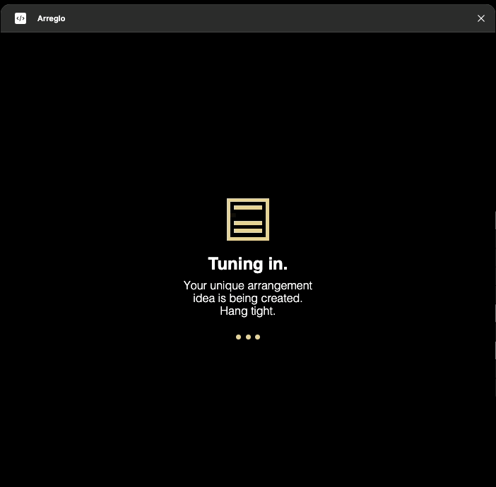

## Arreglo - Figma Plugin

Arreglo is a Figma plugin that helps music producers visualize song arrangements. Using AI with semantic pattern recognition, it generates musically intelligent arrangements based on your instrument patterns and track names, making it easy to plan and understand song structures.

### Current Example Output

This example shows a generated arrangement with:
- Multiple sections (Intro, Verse, Chorus, Bridge, etc.)
- Custom instrument patterns
- Adjustable creativity levels
- Visual grid layout showing when each instrument plays

### Features

- **Intelligent AI Arrangement Generation**: 
  - Creates musically coherent arrangements based on semantic pattern descriptions
  - Understands different pattern types (e.g., "kick - 4x", "bassline - melody")
  - Intelligently places instruments based on their musical role
  - Balances musical conventions with creative freedom

- **Pattern Management**:
  - Add patterns with descriptive names (e.g., "hi-hat - offbeat", "bassline - buildup")
  - Extract track names automatically from DAW screenshots
  - Supports common pattern types: four-on-the-floor, chord progressions, melodies, buildups
  - Strategic placement of samples and featured instruments

- **Customization**:
  - Song length: 16-256 bars
  - Tempo: 60-200 BPM
  - Genre selection: House, Techno, Trance, DnB, Pop, Rock, Jazz, etc.
  - Creativity control: Traditional to Experimental
  - Time signature: 4/4 (common time)

### Usage

1. Install and Run:
   * Clone the repository
   * Install dependencies with `npm install`
   * Build the plugin with `npm run build`

2. Open Figma
   * Open Figma
   * Go to Plugins menu in the top navigation bar
   * Go to Development/Import plugin from manifest
   * Select the `manifest.json` file in the repository
   * Click "Install"
   * Click "Open"

3. Configure (First Time Setup):
   * Open settings (bottom left icon)
   * Add your preferred API key
   * Save settings

4. Create an Arrangement:
   * Enter a song title
   * Choose a genre
   * Set desired length and tempo
   * Add semantic patterns:
     - Use descriptive names (e.g., "kick - 4x", "bassline - melody")
     - Type manually and click "Add Pattern", or
     - Upload a DAW screenshot to extract track names
   * Select desired sections
   * Adjust creativity level
   * Click "Create Arrangement"

5. View Your Arrangement:
   * See a grid showing when each instrument plays
   * Each row represents an instrument with its specific pattern type
   * Colored cells show active bars based on musical context
   * Section labels show the structure of your song
   * Grid displays 4 beats per bar (4/4 time signature)

### Requirements

- Figma Desktop App or Figma Web (in supported browsers)
- OpenAI or Anthropic API key for AI features

### Future Plans
- Support for different time signatures (3/4, 6/8, etc.)
- Export arrangements to JSON and MIDI for DAW Import
- Direct DAW integration for pattern controls (FL Studio Playlist & Pattern Editor)
- Integration with other DAWs
- More granular pattern control (note density, swing, etc.)
- Custom time signature support with adjustable beat divisions
- Visual beat markers and swing grid options

### Screenshots

